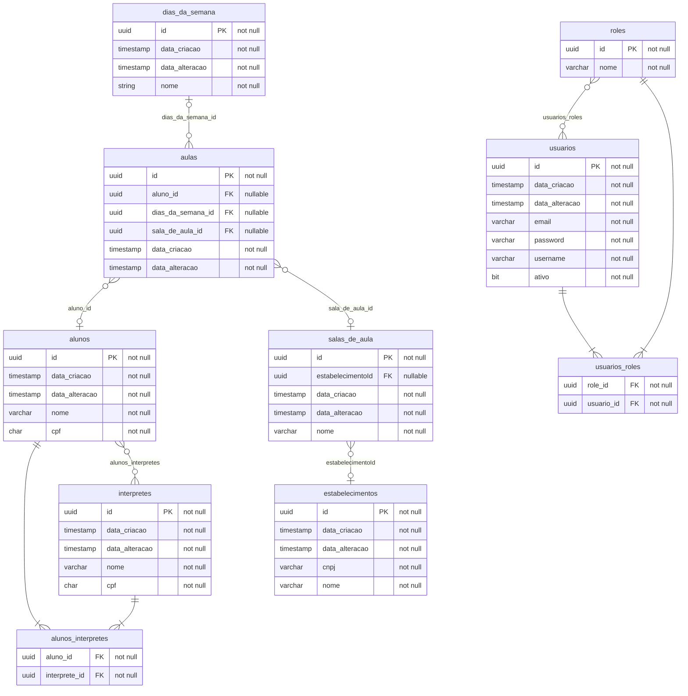

```
erDiagram

interpretes {
  uuid id PK "not null"
  timestamp data_criacao "not null"
  timestamp data_alteracao "not null"
  varchar nome "not null"
  char cpf "not null"
}

alunos {
  uuid id PK "not null"
  timestamp data_criacao "not null"
  timestamp data_alteracao "not null"
  varchar nome "not null"
  char cpf "not null"
}

estabelecimentos {
  uuid id PK "not null"
  timestamp data_criacao "not null"
  timestamp data_alteracao "not null"
  varchar cnpj "not null"
  varchar nome "not null"
}

salas_de_aula {
  uuid id PK "not null"
  uuid estabelecimentoId FK "nullable"
  timestamp data_criacao "not null"
  timestamp data_alteracao "not null"
  varchar nome "not null"
}

aulas {
  uuid id PK "not null"
  uuid aluno_id FK "nullable"
  uuid dias_da_semana_id FK "nullable"
  uuid sala_de_aula_id FK "nullable"
  timestamp data_criacao "not null"
  timestamp data_alteracao "not null"
}

dias_da_semana {
  uuid id PK "not null"
  timestamp data_criacao "not null"
  timestamp data_alteracao "not null"
  string nome "not null"
}

usuarios {
  uuid id PK "not null"
  timestamp data_criacao "not null"
  timestamp data_alteracao "not null"
  varchar email "not null"
  varchar password "not null"
  varchar username "not null"
  bit ativo "not null"
}

roles {
  uuid id PK "not null"
  varchar nome "not null"
}

alunos_interpretes {
  uuid aluno_id FK "not null"
  uuid interprete_id FK "not null"
}

usuarios_roles {
  uuid role_id FK "not null"
  uuid usuario_id FK "not null"
}

roles }o--o{ usuarios: usuarios_roles
roles ||--|{ usuarios_roles: ""
usuarios ||--|{ usuarios_roles: ""
aulas }o--o| alunos: "aluno_id"
alunos ||--|{ alunos_interpretes: ""
alunos }o--o{ interpretes: alunos_interpretes
interpretes ||--|{ alunos_interpretes: ""
aulas }o--o| salas_de_aula: "sala_de_aula_id"
dias_da_semana |o--o{ aulas: "dias_da_semana_id"
salas_de_aula }o--o| estabelecimentos: "estabelecimentoId"
```
